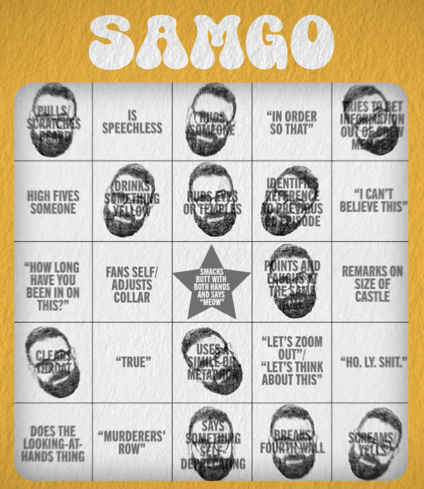

# Samgo V2

[A bingo card for Sam](https://samgo.mikeware.com)! To use while watching any [Game Changer](https://www.dropout.tv/game-changer) episode. A layer deeper from [S6E5's "Bingo" episode](https://www.dropout.tv/game-changer/season:6/videos/bingo). Inspired by said episode, created in 2024 before the real Samgo arrived in 2025...



Above is the Samgo card featured in [S7E11's "Samalamadingdong" episode](https://www.dropout.tv/game-changer/season:7/videos/samalamadingdong) where the Bingo episode motif is used again. (Credit to `the_noah` on the `Dropout: Extra Credit` Discord for screen-capturing it.)

## Disclaimer: This Fan Game is Not Associated with Dropout or Game Changer

This fan game is not affiliated with, endorsed by, or sponsored by Dropout or Game Changer. All logos, audio, and other intellectual property rights belong to their respective owners. This project was made purely for educational and entertainment purposes and does not seek to infringe upon any copyrights or trademarks.

For any inquiries or concerns, please reach out to [Mikeware](https://x.com/MikewareXGR).

- The intro audio clip and GC logo are from [S3E15 - Secret Samta 2: The Samta Clause](https://www.dropout.tv/game-changer/season:3/videos/secret-samta-2-the-samta-clause)
- The ending audio clip is from [S2E4 - A Sponsored Episode](https://www.dropout.tv/game-changer/season:2/videos/a-sponsored-episode)

The code itself is currently intentionally unlicensed (retained by me) and just here for others educational benefit and hosting.

## Project Info

This was an educational endeavour to learn more about [Vue 3](https://vuejs.org/) and CSS animations. It was built from the base Vue.js template but using [Bun](https://bun.sh/).

Hmmm, GitHub Pages workflow working, but assets not found... mystery for another day... Find [game here](https://samgo.mikeware.com).

Tested on PC with Edge and Firefox, Android Chrome, iPhone Brave and Safari browsers.

## History

- August 29, 2025 - **V2** - Add Sharable Completed Board State Link, head wiggling, and Published!
- August 28, 2025 - Start V2 Update: Sam's card color, new squares
- August 25, 2025 - [S7E11's "Samalamadingdong" episode](https://www.dropout.tv/game-changer/season:7/videos/samalamadingdong) Airs
- April 22, 2024 - **V1** - Published in time for next episode!
- April 21, 2024 - Finishing touches and build work for shipping, test against Bingo episode itself
- April 20, 2024 - Stamp w/ Sound, Win Check, Confetti and Winning Sound - Play-tested against an episode
- April 19, 2024 - Loading screen work
- April 18, 2024 - Initial prototype, displaying board
- April 17, 2024 - Started looking at code for app
- April 16, 2024 - Worked on Sam's face Stamp
- April 15, 2024 - [Behind the Scenes of "Bingo"](https://www.dropout.tv/game-changer/season:6/videos/behind-the-scenes-of-bingo) Airs, Sam has been posting images of player's Bingo cards.
  - Idea for Samgo app born
  - "I've been here the whole time" as free-space
- April 8, 2024 - [S6E5 Bingo episode](https://www.dropout.tv/game-changer/season:6/videos/bingo) Airs

---

Original template instructions below.

## Recommended IDE Setup

[VSCode](https://code.visualstudio.com/) + [Volar](https://marketplace.visualstudio.com/items?itemName=Vue.volar) (and disable Vetur).

## Type Support for `.vue` Imports in TS

TypeScript cannot handle type information for `.vue` imports by default, so we replace the `tsc` CLI with `vue-tsc` for type checking. In editors, we need [Volar](https://marketplace.visualstudio.com/items?itemName=Vue.volar) to make the TypeScript language service aware of `.vue` types.

## Customize configuration

See [Vite Configuration Reference](https://vitejs.dev/config/).

## Project Setup

```sh
bun install
```

### Compile and Hot-Reload for Development

```sh
bun run dev
```

### Type-Check, Compile and Minify for Production

```sh
bun run build
```

### Lint with [ESLint](https://eslint.org/)

```sh
bun run lint
```
